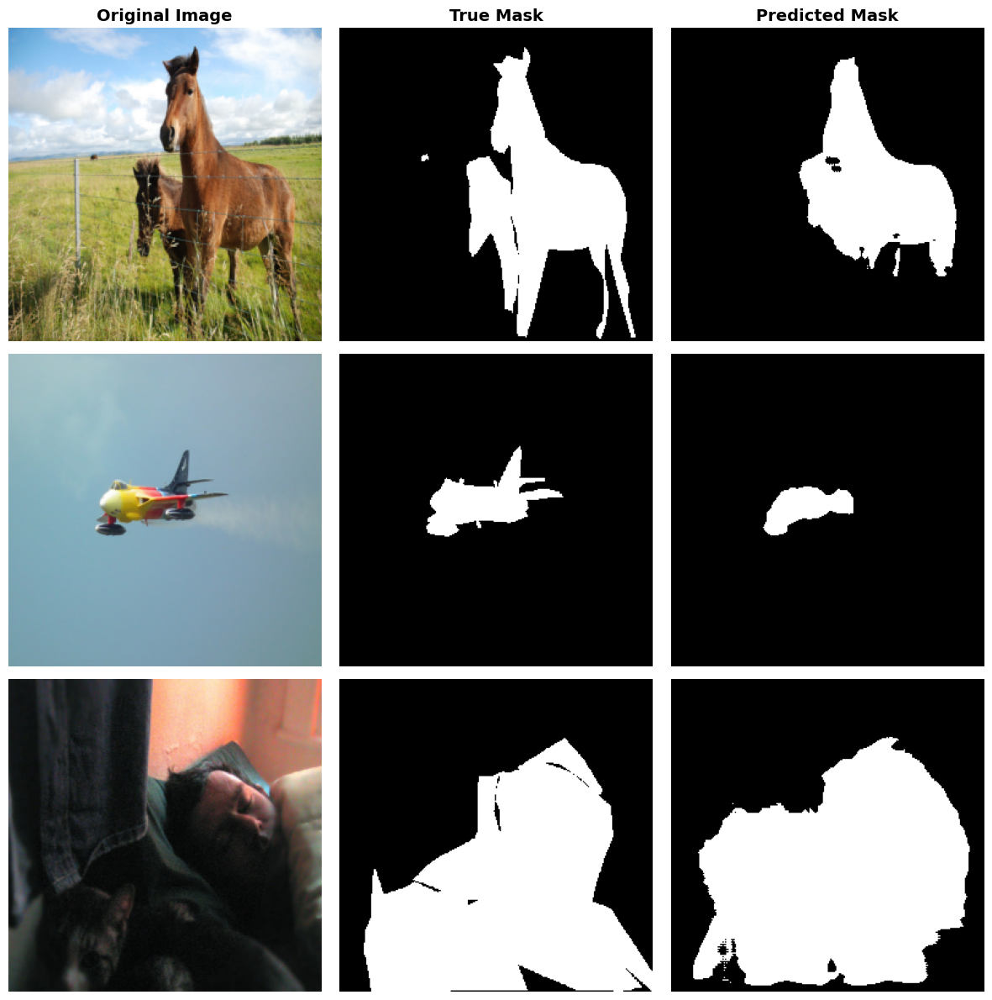

# U-Net: Foreground / Background Segmentation on COCO

A **U-Net implemented from scratch in PyTorch** that segments objects from the background in everyday photos, trained on the [COCO 2017](https://cocodataset.org) dataset.



## Highlights

- **U-Net written from scratch**: 5-level encoder-decoder (64 → 1024 channels) with transposed convolutions and skip connections
- **Custom COCO dataset class** that turns instance annotations into a single binary mask, instead of the heavy `CocoDetection` metadata
- **Mean Dice score of 0.56** on the COCO validation set after only 5 epochs on 10,000 images
- **Multi-GPU ready**: `DataParallel`, `pin_memory` and parallel data loading

## How it works

- **Task:** binary segmentation. Every annotated object in COCO, whatever its category, is merged into one foreground mask.
- **Data:** images resized to 256×256 (masks with nearest-neighbour interpolation), random subset of 10,000 training images out of the ~118,000 available.
- **Model:** each level is two 3×3 convolutions with ReLU. Max pooling goes down, transposed convolutions come back up, and encoder features are concatenated to the decoder at each level. A final 1×1 convolution outputs one logit per pixel.
- **Training:** `BCEWithLogitsLoss`, Adam with a learning rate of 1e-4, batch size 16, 5 epochs.
- **Evaluation:** BCE loss and Dice score on the COCO validation set after each epoch.

## Results

| Epoch | 1 | 2 | 3 | 4 | 5 |
|---|---|---|---|---|---|
| Mean Dice | 0.359 | 0.607 | **0.614** | 0.552 | 0.564 |
| Mean BCE loss | 0.509 | 0.556 | 0.473 | 0.454 | **0.449** |

The model finds the main objects and their rough shape (see the figure above), but masks are still imprecise on small objects and cluttered scenes. The Dice score is not stable from one epoch to the next, so these numbers should be read as a baseline, not as a tuned result.

## Run it

The notebook was developed on **Kaggle** (GPU, Python 3.12).

1. Upload `u-net.ipynb` to a Kaggle notebook and add the dataset [`awsaf49/coco-2017-dataset`](https://www.kaggle.com/datasets/awsaf49/coco-2017-dataset).
2. Enable a GPU and run all cells.

To run it elsewhere, download the dataset with `kagglehub`, edit the `PATH_TO_*` constants in the second cell, and install:

```bash
pip install torch torchvision pycocotools numpy matplotlib pillow kagglehub
```

## Limitations and next steps

- Basic U-Net without **batch normalization**, which would stabilize and speed up training
- **No hyperparameter search** (learning rate, epochs, loss function), because each training run is long even on Kaggle GPUs
- Trained on **about 8 % of the training set** for 5 epochs only
- Possible improvements: train on the full dataset, combine BCE with a Dice loss, and extend to multi-class segmentation
